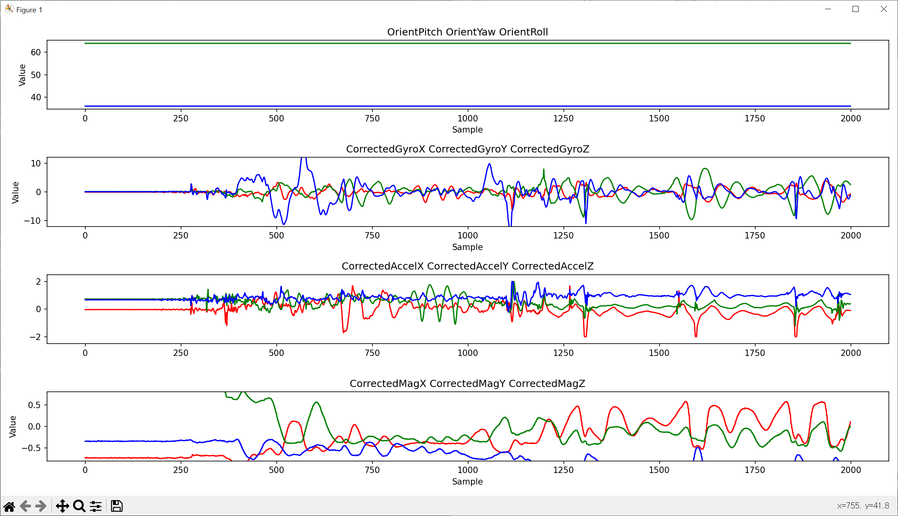

# PosNet_2023capstone_design

각자 이름의 폴더에서 작업을 진행하시면 됩니다.

----------NSY--------------------------------------------------------

IMU 센서 이용

NSY/ThreeSpaceAPI_py3_beta_V0.6/workspace의 IMU 시리즈 이용하시면 됩니다.

